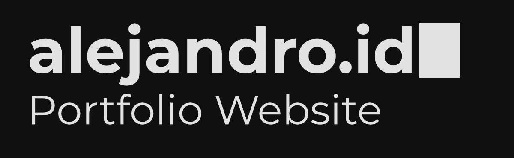

# 

[alejandro.id](https://www.alejandro.id) is the current site I use to show off some projects from my portfolio and to share my actual resume PDF file. I've made it open source, so if you'd like to use this as a basis for your own portfolio, feel free to fork!

# Getting Started

To get started, I suggest you take a look at Github's quickstart guide [Fork a repo](https://docs.github.com/en/get-started/quickstart/fork-a-repo), as it goes into the necessary detail to get this project up and running.

# Overview

Below is an overview of each file within this project:

## Root Directory

`index.html` - The defualt website page. All aspects of the site are brought together within this file.

## Scripts Directory

`main.js` - Includes the main logic behind the dark/light themes, mobile navbar system, and the typewriter style text.

`zenscroll-min.js` - A minified script to ensure that when a user clicks an anchor link on Safari mobile, their screen scrolls smoothly to that location. [Learn more on the zenscroll.js Github](https://github.com/zengabor/zenscroll).

## Styles Directory

`./sections/about.css` - Styling for the 'About Me' section of the site.

`./sections/contact.css` - Styling for the 'Contact Me' section of the site.

`./sections/home.css` - Styling for the 'Home' section of the site.

`./sections/projects.css` - Styling for the 'Projects' section of the site.

`fonts.css` - Making the fonts available within the CSS.

`main.css` - The main CSS file. All other CSS files are imported here, and then this file is used as the singular stylesheet for `index.html`.

`navbar.css` - Styling for the navbar.

# License

This project is licensed under MIT. If you plan to fork this project and change the license, keep in mind that this project also uses outside projects which may include different licenses.
